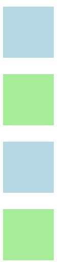

# CSS

## 1.如何定义CSS？

CSS的全称叫做层叠样式表，简单理解就是在一些`html`的基础标签上加上一些样式，从而变得不太一样。

### 1.1 行内样式表

通过`style`标签来在一个标签内部使用`css`样式，注意只改变当前的标签。

比如想让一个图片水平居中：

```html

<!--使用了style类型来使图片居中-->
```


### 1.2 内部样式表

行内样式表只能够修饰一个标签，如果需要将一个图片都居中呢？可以在开头写一个`style`标签，然后在里面写入需要的CSS样式。

```html
  <style>
      img {
          width: 300px;
          display: block;
          margin:auto;
      }
  </style>
```

这样以后每一次使用`img`标签都可以居中了。

#### 1.2.1 类选择器

对于一个`p`标签，如果对于某个标签需要蓝色背景，而其他的都是绿色背景呢？

那么就可以对某些标签使用一个`class`属性，然后再`style`中使用`.`加上`class`的名字即可。

```html
<style>
    p {
        width: 50px;
        height: 50px; /*需要指定大小*/
        background-color: lightgreen;
    }
    .blue-p{
        background-color: lightblue;
    }

</style>

  <p class="blue-p"></p>
  <p></p>
  <p class="blue-p"></p>
  <p></p>
```



### 1.3 外部样式表

内部样式表只能对一个页面起作用，往往网站的开发需要很多个页面，因此可以将内部样式表提出在外部，并在要使用的`html`文件中使用`link`。

外部的`style.css`:

```css
img {
    width: 300px;
    display: block;
    margin: auto;/*两个都要*/
    border-radius: 50%;
}
p {
    width: 50px;
    height: 50px;
    background-color:aqua;
}
.blue-p {
    background-color: brown; /*可见有继承的关系 */
}
```

使用的`index.html`：

```html
<link rel="stylesheet" href="static/css/style.css">
```

这里的`href`是指定的`style.css`的路径